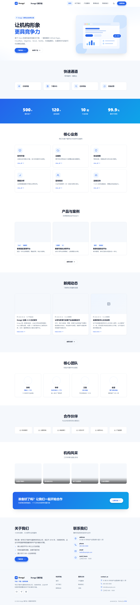
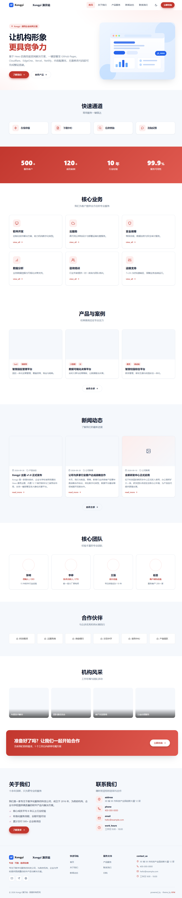
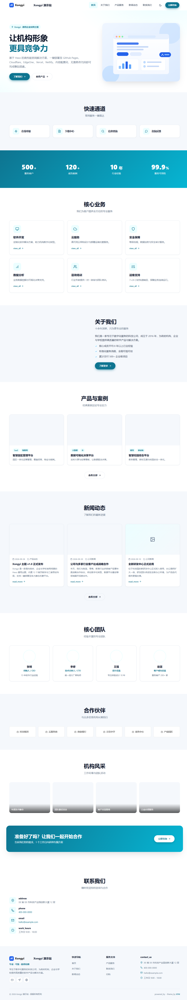

# hexo-theme-xongyi

[](LICENSE)
[](https://hexo.io)
[](https://nodejs.org)
[](https://github.com/xfm0797/hexo-theme-xongyi-demo)

**Xongyi** 是一款面向机构官网场景的 Hexo 通用主题，内置**企业 / 政务 / 教育**三套预设布局与 12 个可自由排序的首页板块，60+ 项配置全部集中在 `_config.yml`，无需修改代码即可完成整站搭建。

> **演示站**：[hexo-theme-xongyi-demo](https://github.com/xfm0797/hexo-theme-xongyi-demo) — 完整 Hexo 站点，含全部页面、示例文章与五大平台一键部署配置
>
> 主题开发者：**XFM** ｜ [https://www.lovou.pw](https://www.lovou.pw) ｜ [Telegram: @xfm520](https://t.me/xfm520) ｜ njat6880@agent.qq.com

## 🖼 预设布局预览

| 企业版 enterprise | 政务版 government | 教育版 education |
| --- | --- | --- |
|  |  |  |

---

## ✨ 特性一览

- 🏢 **三套预设布局**：`enterprise`（商务蓝）/ `government`（政务红）/ `education`（学院青），一行配置切换
- 🧩 **12 个首页板块**：横幅、快捷入口、数据统计、核心业务、关于我们、产品案例、新闻动态、团队、合作伙伴、风采图库、行动条、联系我们——支持启用 / 关闭 / 自由排序，另有「关于我们 + 联系我们」左右合排版
- ⚙️ **60+ 配置项**：品牌、导航、页脚、备案号、社交链接、SEO、统计代码、联系表单、地图嵌入……全部配置化
- 🌙 **暗色模式**：跟随记忆的明暗切换，三套预设各自适配
- 📱 **完全响应式**：桌面 / 平板 / 手机抽屉菜单，移动端体验完整
- 🚀 **轻量高性能**：零框架依赖（原生 JS + 单 CSS 文件），Lighthouse 表现优异
- 🔍 **SEO 友好**：Open Graph / Twitter Card / JSON-LD 结构化数据、canonical 全覆盖
- 🌐 **国际化**：内置 zh-CN / en 文案包
- 📰 **新闻系统**：文章即动态，自动生成新闻列表、归档、分类、标签页
- ♿ **无障碍**：跳转链接、aria 标签、`prefers-reduced-motion` 支持

## 🚀 安装

### 方式一：Git 安装（推荐）

```bash
# 在 Hexo 站点根目录执行
git clone https://github.com/xfm0797/hexo-theme-xongyi.git themes/hexo-theme-xongyi
```

### 方式二：下载解压

从 [Releases](https://github.com/xfm0797/hexo-theme-xongyi/releases) 或仓库 `Code → Download ZIP` 下载后，解压到站点的 `themes/hexo-theme-xongyi/` 目录（**仓库根目录即主题本体**，解压后确认 `themes/hexo-theme-xongyi/_config.yml`、`layout/`、`source/` 直接位于该目录下）。

### 方式三：作为 submodule 引入

```bash
git submodule add https://github.com/xfm0797/hexo-theme-xongyi.git themes/hexo-theme-xongyi
```

### 启用主题

编辑站点根目录 `_config.yml`：

```yaml
theme: hexo-theme-xongyi
```

然后 `hexo clean && hexo server` 即可预览。

> 目录名遵循 Hexo 官方主题命名规范 **`hexo-theme-<name>`**。主题的 `_config.yml`、`layout/`、`source/`、`scripts/`、`languages/` 全部独立收纳在该文件夹内，可直接复制到任意 Hexo 站点的 `themes/` 目录下使用。

### 懒得配置？直接用演示站

[**hexo-theme-xongyi-demo**](https://github.com/xfm0797/hexo-theme-xongyi-demo) 是配好一切的完整站点（主题以 submodule 引入 + 演示内容 + 部署配置），Fork 后一键部署即可：

| 平台 | 部署按钮 |
| --- | --- |
| Netlify | [](https://app.netlify.com/start/deploy?repository=https://github.com/xfm0797/hexo-theme-xongyi-demo) |
| Vercel | [](https://vercel.com/new/clone?repository-url=https%3A%2F%2Fgithub.com%2Fxfm0797%2Fhexo-theme-xongyi-demo) |
| Cloudflare | [](https://deploy.workers.cloudflare.com/?url=https://github.com/xfm0797/hexo-theme-xongyi-demo) |

> 演示站仓库内置 `.github/workflows/pages.yml`（GitHub Pages）、`vercel.json`、`netlify.toml`、`wrangler.toml`、`edgeone.json`（腾讯 EdgeOne Pages），导入即用。

## ⚙️ 配置

主题配置位于 **`themes/hexo-theme-xongyi/_config.yml`**，所有可调项都带中文注释。

> **推荐做法**：不要在主题目录里直接改配置。在站点根目录新建 `_config.hexo-theme-xongyi.yml`，只写你要覆盖的键，Hexo 会与主题默认配置**深度合并**。这样 `git pull` 升级主题时不会丢失你的自定义内容。
>
> ```yaml
> # 站点根目录 _config.hexo-theme-xongyi.yml
> brand:
>   name: "我的公司"
> preset: government
> ```

### 🎨 切换预设布局

编辑主题配置第一项：

```yaml
preset: enterprise   # 企业（默认，商务蓝）
preset: government   # 政务（中国红）
preset: education    # 教育（学院青）
```

完整整站示例见 [`examples/config.government.yml`](examples/config.government.yml) 与 [`examples/config.education.yml`](examples/config.education.yml)，直接覆盖主题配置即可获得一套完整的政务 / 校园官网。

### 🧱 首页板块编排

```yaml
sections:
  - hero            # 首屏横幅
  - quicklinks      # 快捷入口（政务/校园常用）
  - stats           # 数据统计（数字滚动动画）
  - services        # 核心业务
  - about           # 关于我们
  - products        # 产品与案例
  - news            # 新闻动态（自动取最新文章）
  - team            # 团队 / 名师风采
  - partners        # 合作伙伴
  - gallery         # 风采图库
  - cta             # 行动号召条
  - contact         # 联系我们
  - about-contact   # 关于我们 + 联系我们 左右合排（一屏收尾）
```

删除任意一行即隐藏该板块；调整顺序即调整首页结构。每个板块的数据（标题、副标题、条目、图标、链接）都在 `_config.yml` 对应节点下配置。

### 🖼 图标速查

在 `services` / `quicklinks` / `social` 等配置中通过 `icon: 名称` 使用（Feather 风格线性图标）：

```
rocket monitor cloud shield shield-check chart code settings search
users user phone mail map-pin clock calendar star award target zap
file-text download globe book book-open graduation building briefcase
heart message-circle send github link external menu x moon sun image
tag folder layers home info trending-up check check-circle arrow-right
```

### 📌 常用配置速查

| 配置 | 说明 |
| --- | --- |
| `preset` | 预设风格：enterprise / government / education |
| `brand` | 站点名称、slogan、logo、favicon |
| `menu` / `nav_button` | 顶部导航与右侧按钮 |
| `sections` | 首页板块顺序 |
| `hero` | 首屏文案、按钮、插图（title 支持 `<em>` 高亮、`<br>` 换行） |
| `contact` | 地址 / 电话 / 邮箱 / 服务时间 / 微信二维码 / 表单 / 地图 |
| `footer.icp` | ICP 备案号与公安备案号 |
| `features` | 暗色模式、返回顶部、滚动动画、吸顶导航开关 |
| `seo` | 描述、关键词、JSON-LD |
| `analytics` | Google Analytics / Cloudflare Analytics ID |

## 📂 目录结构

```
hexo-theme-xongyi/                 # 仓库根 = 主题本体（可直接放进站点 themes/ 目录）
├── _config.yml                    # ★ 主题配置（带中文注释，日常只需改这个文件）
├── layout/                        # EJS 布局
│   ├── layout.ejs                 # HTML 骨架
│   ├── index.ejs                  # 首页（按 sections 渲染板块）
│   ├── page.ejs / post.ejs        # 页面 / 文章
│   ├── news.ejs / archive.ejs     # 新闻列表 / 归档
│   ├── category.ejs / tag.ejs     # 分类 / 标签
│   └── _partial/                  # 头部、页脚、脚本与 13 个首页板块
├── scripts/icons.js               # 图标 helper（30+ Feather 线性图标）
├── source/                        # 主题静态资源
│   ├── css/style.css              # 全部样式（CSS 变量 + 三套预设 + 暗色）
│   ├── js/main.js                 # 交互脚本
│   └── images/                    # logo / favicon / 插图 / 缩略图
├── languages/                     # zh-CN / en 文案包
├── examples/                      # 政务 / 教育两套完整预设示例
├── docs/                          # 预览图与部署按钮素材
├── package.json                   # 主题包元信息
└── LICENSE
```

## 📝 写新闻

在站点 `source/_posts/` 下新建 Markdown：

```markdown
---
title: 文章标题
date: 2026-10-01 10:00:00
categories: [公司新闻]
tags: [活动]
cover: /images/thumb-1.svg   # 可选封面
excerpt: 摘要（可选，用于列表卡片）
---
正文内容……
```

文章会自动出现在首页「新闻动态」、`/news/` 页与 `/archives/` 归档中。

## 🧩 兼容性

| 项目 | 要求 |
| --- | --- |
| Hexo | 7.x（推荐） |
| Node.js | >= 18 |
| 渲染器 | `hexo-renderer-ejs`（必需）、`hexo-renderer-marked`（或其它 Markdown 渲染器） |
| 生成器 | 新闻 / 归档 / 分类 / 标签页需要 `hexo-generator-index`、`hexo-generator-archive`、`hexo-generator-category`、`hexo-generator-tag` |

> ⚠️ Hexo 7 核心**不自带**上述四个生成器，`hexo init` 的默认站点已包含；若你的站点缺首页或归档，请补装。

## 📄 License

[MIT](LICENSE) © 2026 XFM

如果觉得这个主题不错，欢迎 ⭐ Star 支持，也欢迎通过 [Telegram](https://t.me/xfm520) 反馈问题与建议。
